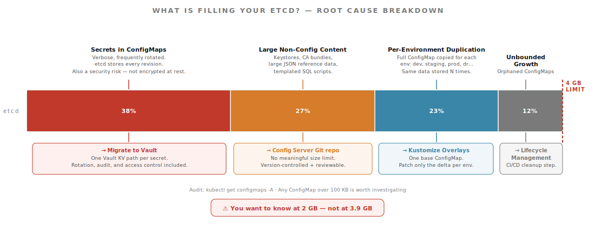

<!-- .slide: data-background-color="#6db33f" data-background-transition="zoom" -->
# Section 5
## The etcd Size Problem
### A Diagnostic Lens

Notes:
- This section connects operational pain directly back to the decision framework.
- The 4GB etcd limit is a useful forcing function — when teams bump into it, it's almost always a symptom of one of four underlying issues.

---



Notes:
- etcd doesn't compress. Every ConfigMap byte counts.
- Hitting the limit stops the entire cluster from accepting writes — it's a production incident, not a storage ticket.
- The four segments are ordered by typical real-world impact. Secrets in ConfigMaps is almost always the biggest contributor and the highest-priority fix.
- The goal is to know at 2 GB, not 3.9 GB — set up a size alert before you need it.

---

## Root Cause 1: Secrets in ConfigMaps

```bash
# Find ConfigMaps that look like they contain secrets
kubectl get configmaps -A -o json | \
  jq '.items[] | select(.data != null) |
  select(.data | to_entries[] | .value |
  test("password|secret|token|key|credential"; "i")) |
  .metadata | {namespace, name}'
```

* Secrets are verbose and frequently rotated
* Each rotation = new ConfigMap version in etcd history
* **Fix**: migrate to Vault. One Vault path per secret.

Notes:
- Secrets in ConfigMaps are the single biggest contributor to etcd bloat. They're verbose, they change often, and etcd keeps history.
- This is also a security problem — ConfigMaps are not encrypted at rest by default.

---

## Root Cause 2: Large Non-Config Content

Common offenders:

| Content | Size | Better Home |
|---|---|---|
| Java keystores (.jks, .p12) | 50–500 KB | Vault PKI secrets engine |
| CA certificate bundles | 10–100 KB | Vault PKI or mounted Secret |
| Large JSON reference data | 100 KB+ | Config Server Git repo |
| Templated SQL scripts | Variable | Config Server Git repo or init container |

Notes:
- ConfigMaps have a 1 MB per-object limit anyway. Anything approaching that limit belongs somewhere else.
- "Non-config content" means: if it's not a property key-value pair, it probably shouldn't be in a ConfigMap.

---

## Root Cause 3: Per-Environment Duplication

```bash
# The problem: same config copied N times
kubectl get configmaps -A | grep payments-service
# payments-service-config-dev
# payments-service-config-staging
# payments-service-config-prod
# payments-service-config-dr
```

**Fix: Use Kustomize overlays** — maintain a base once, patch per environment.

Notes:
- Every duplicated ConfigMap multiplies your etcd footprint by N environments.
- Kustomize is built into kubectl. No extra tooling required.

---

## Kustomize Overlay Pattern

```
config/
├── base/
│   ├── configmap.yaml        # shared defaults
│   └── kustomization.yaml
└── overlays/
    ├── dev/
    │   ├── patch.yaml        # dev-specific overrides
    │   └── kustomization.yaml
    └── prod/
        ├── patch.yaml        # prod-specific overrides
        └── kustomization.yaml
```

```bash
kubectl apply -k config/overlays/prod/
```

Notes:
- The base ConfigMap is stored once. Overlays store only the delta.
- This pattern also makes it obvious what differs between environments — a focused patch file rather than a full copy.

---

## Root Cause 4: Unbounded Growth

```bash
# Audit all ConfigMaps across the cluster
kubectl get configmaps -A --sort-by=.metadata.creationTimestamp

# Find ConfigMaps from apps that no longer exist
kubectl get configmaps -A -o json | \
  jq '.items[] | select(.metadata.ownerReferences == null) |
  .metadata | {namespace, name, creationTimestamp}'
```

* Deprecated apps leave their ConfigMaps behind
* CI/CD pipelines create new ConfigMaps without deleting old ones
* **Fix**: lifecycle management + CI/CD cleanup step

Notes:
- etcd bloat from orphaned ConfigMaps is easy to miss because no one owns cleanup.
- A monthly audit job that flags ConfigMaps older than 90 days with no owning deployment is a low-effort win.

---

## Practical Remediation Steps

1. **Audit** ConfigMaps for secrets → migrate any found to Vault
2. **Audit** for large non-config content → move to Config Server Git repo or external storage
3. **Eliminate** per-environment duplication with Kustomize or Helm
4. **Set up** a ConfigMap size monitoring alert before hitting the limit
5. **Add** a CI/CD gate that flags unusually large ConfigMaps on merge

Notes:
- Do these in order. Step 1 (secrets) gives you the most immediate relief and the biggest security win.
- Step 4 gives you early warning. You want to know at 2 GB, not at 3.9 GB.

---

## Monitoring ConfigMap Size

```bash
# Check total etcd database size
kubectl get --raw /healthz/etcd

# Check individual ConfigMap sizes
kubectl get configmaps -A -o json | \
  jq '.items[] |
  {namespace: .metadata.namespace,
   name: .metadata.name,
   size: (.data // {} | to_entries | map(.value | length) | add // 0)} |
  select(.size > 100000)' | jq -s 'sort_by(-.size)'
```

Notes:
- Run this now in your cluster before you have a problem, not during an incident.
- Any ConfigMap over 100 KB is worth investigating.

---

## The ConfigMap Lean Rule

> **If Kubernetes doesn't need to know about it directly, it probably shouldn't be in a ConfigMap.**

| Belongs in ConfigMap | Belongs Elsewhere |
|---|---|
| App-specific tuning params | Secrets and credentials |
| Environment bindings (service URLs) | Large reference data |
| Non-sensitive app-specific values | Config shared across many apps |
| Kubernetes-native config | Frequently-rotated values |

Notes:
- Vault is purpose-built for large, frequently-rotated secrets.
- Spring Cloud Config's Git-backed store has no meaningful size constraint for config.
- ConfigMaps should be lean by design.
