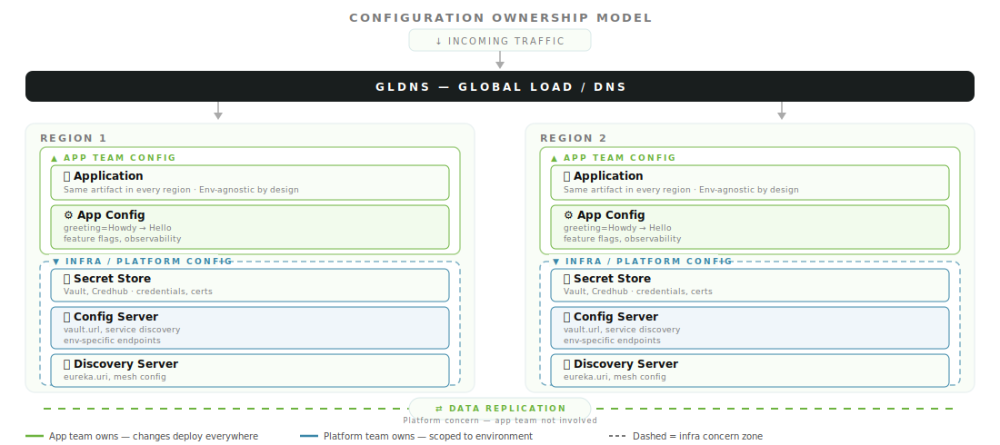

<!-- .slide: data-background-color="#191e1e" data-background-transition="zoom" -->
# Section 4
## Where to Put It: The Four-Tier Layering Model

Notes:
- The decision tree tells you to externalize. This section tells you where specifically.
- Before we get into the tiers, let's establish the ownership model that motivates the whole structure.

---



Notes:
- This is the mental model behind everything in this section.
- The app is env-agnostic — the same artifact runs in every region. The app team owns the app and its config.
- The dashed line is the boundary. Everything below it — data store, config server, discovery — is an infra/platform concern. The app team doesn't need to care or be involved when those values change.
- Changing the greeting from "Howdy" to "Hello"? App team change. Propagates everywhere. Platform team not involved.
- Rotating the Vault URL in a region? Platform team change. Scoped to that environment. App team not involved.
- The four-tier model gives each concern a home that respects this boundary.

---

## The Four Tiers

| Layer | Tool | Best For |
|---|---|---|
| **Secrets** | HashiCorp Vault + Spring Cloud Vault | Credentials, API keys, TLS certs |
| **Shared Config** | Spring Cloud Config | DB URLs, shared endpoints, org-wide defaults |
| **App-Specific Config** | Kubernetes ConfigMap | App tuning, env bindings, non-sensitive app values |
| **Defaults / Fallbacks** | `application.properties` in JAR | Truly static defaults, rarely-changing constants |

Notes:
- Each tier has a clear owner. Secrets live in Vault — Vault owns rotation and audit. Shared config lives in Git. App-specific config lives in Kubernetes. Defaults live in the JAR.

---

## Tier 1: Secrets → Vault

```yaml
# bootstrap.yml — Vault config resolved before app starts
spring:
  cloud:
    vault:
      host: vault.internal
      port: 8200
      authentication: KUBERNETES
      kubernetes:
        role: my-app
      kv:
        enabled: true
        default-context: my-app
```

* Vault **owns** rotation, access control, and audit trails
* Spring Cloud Vault resolves secrets **before** the application context starts

Notes:
- Kubernetes authentication is the recommended approach in-cluster. Your pod's service account token authenticates to Vault.
- Spring Cloud Vault uses bootstrap context — it runs before Spring Cloud Config and before your app beans are created.

---

## Tier 1: Reading Secrets

```java
@ConfigurationProperties(prefix = "myapp.db")
public record DatabaseProperties(
    String url,
    String username,
    String password   // resolved from Vault at startup
) {}
```

```yaml
# application.yml — references Vault-resolved env vars
spring:
  datasource:
    url: ${myapp.db.url}
    username: ${myapp.db.username}
    password: ${myapp.db.password}
```

Notes:
- You never write the actual secret value anywhere in your config files.
- The property placeholder resolves to whatever Vault returned at startup.

---

## Tier 2: Shared Config → Spring Cloud Config

```yaml
# Config Server application.yml
spring:
  cloud:
    config:
      server:
        git:
          uri: https://github.com/my-org/config-repo
          default-label: main
          search-paths: '{application}'
```

* Git-backed — **treat config as code**
* Pull requests, history, rollback built in
* Per-environment profiles: `application-dev.yml`, `application-prod.yml`

Notes:
- The Git-backed Config Server means every config change has an author, a timestamp, and a reviewable PR.
- Search paths let you organize config by application name — each app gets its own directory in the repo.

---

## Tier 2: Client Configuration

```yaml
# bootstrap.yml in each client app
spring:
  application:
    name: payments-service
  cloud:
    config:
      uri: http://config-server:8888
      fail-fast: true
      retry:
        max-attempts: 6
        initial-interval: 1000
```

Notes:
- fail-fast: true is critical in production. If the Config Server is unreachable at startup, fail loudly rather than starting with incomplete config.
- retry is your safety net for transient Config Server unavailability.

---

## Tier 3: App-Specific Config → ConfigMap

```yaml
# k8s/configmap.yaml
apiVersion: v1
kind: ConfigMap
metadata:
  name: payments-service-config
data:
  application.yaml: |
    myapp:
      payments:
        timeout-ms: 5000
        max-retries: 3
        thread-pool-size: 20
```

* Kubernetes **needs** to know about it directly
* Non-sensitive, app-specific tuning only
* **Keep lean** — if it isn't Kubernetes-native, it probably belongs in Config Server

Notes:
- The ConfigMap lean rule: if Kubernetes doesn't need to directly manage this value, it shouldn't be in a ConfigMap.
- Pod restarts, rolling updates, namespace isolation — those are the Kubernetes-native concerns that justify a ConfigMap.

---

## Tier 3: Mounting ConfigMaps

```yaml
# k8s/deployment.yaml
spec:
  containers:
    - name: payments-service
      image: my-org/payments-service:1.2.0
      volumeMounts:
        - name: config
          mountPath: /config
          readOnly: true
  volumes:
    - name: config
      configMap:
        name: payments-service-config
```

Notes:
- Spring Boot auto-detects application.yaml in /config — this is a standard Spring Boot external config location.
- No code changes needed. The ConfigMap content is just another property source.

---

## Tier 4: Defaults → application.properties

```properties
# application.properties — static defaults that rarely change
server.shutdown=graceful
spring.jpa.open-in-view=false
management.endpoints.web.exposure.include=health,info,prometheus
spring.lifecycle.timeout-per-shutdown-phase=30s
```

> If it belongs here, **document why** it isn't in a higher tier.

Notes:
- These are the values that make sense baked into the JAR because they represent the application's designed behavior.
- The documentation requirement is a forcing function: if you can't explain why it lives here, maybe it should be externalized.

---

## Spring Boot Property Source Precedence

From highest to lowest priority:

1. Command-line arguments
2. `SPRING_APPLICATION_JSON` env var
3. OS environment variables
4. `application-{profile}.properties` (external)
5. **ConfigMap / Config Server** (external)
6. `application.properties` (inside JAR)
7. `@PropertySource` annotations
8. Default properties

Notes:
- ConfigMaps and Config Server both inject into the Spring Environment. Higher in the list = wins.
- This is how you intentionally override: a ConfigMap value beats the in-JAR default without touching the code.

---

## Vault + ConfigMap: Separation of Concerns

| Concern | Owner |
|---|---|
| Secret values | **Vault** — rotation, access control, audit |
| Config file shape | **ConfigMap** — which properties exist, how they're organized |
| Config history & review | **Git** (Config Server repo) |
| App-specific tuning | **ConfigMap** |

Notes:
- The config file in the ConfigMap becomes a template with property references, not a file containing real values.
- ConfigMaps are safe to store in version control when they contain no secrets. Vault handles secret sprawl.

---

## Vault + ConfigMap: The Architecture

```
┌─────────────┐    startup    ┌────────────────┐
│  Spring App │──────────────▶│  Spring Cloud  │
│             │               │     Vault      │
│             │◀──────────────│  (secrets)     │
│             │  resolved     └────────────────┘
│             │  properties
│             │    startup    ┌────────────────┐
│             │──────────────▶│  Spring Cloud  │
│             │               │  Config Server │
│             │◀──────────────│  (shared cfg)  │
│             │               └────────────────┘
│             │
│             │  mounted      ┌────────────────┐
│             │◀──────────────│   ConfigMap    │
│             │               │  (app tuning)  │
└─────────────┘               └────────────────┘
```

Notes:
- Boot ordering matters: Vault runs in bootstrap context → Config Server → application context → ConfigMap mount.
- Vault secrets are available when Config Server properties are resolved — so Config Server config can reference Vault-resolved values.
