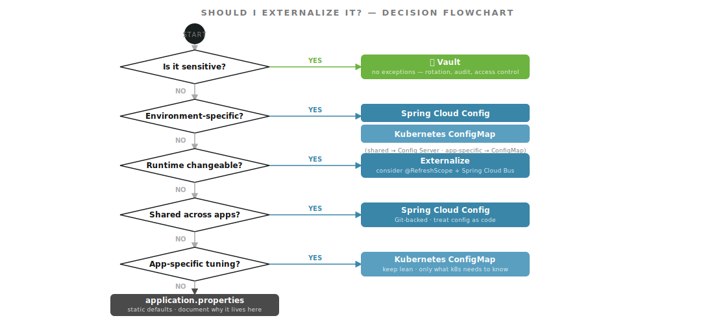

<!-- .slide: data-background-color="#191e1e" data-background-transition="zoom" -->
# Section 6
## Patterns & Anti-Patterns

Notes:
- Let's codify what good looks like — and name the traps.

---

## Patterns to Encourage

* Use **Spring Cloud Config** for org-wide defaults individual apps can selectively override
* **Namespace config keys** clearly: `myorg.payments.timeout-ms` signals ownership
* **Version your Config Server repo** — treat config as code, use pull requests
* Use **Spring profiles** to cleanly separate environment-specific values
* **Clear rule**: if it's sensitive, it lives in Vault — full stop

Notes:
- The namespace convention pays dividends in large orgs. When you see myorg.payments.timeout-ms in a log, you know exactly which team owns it and where to find it.

---

## Anti-Patterns to Avoid

* **Config sprawl** — the same property defined in 3 places with unclear precedence
* **Externalizing business logic** — properties that encode decisions belong in code
* **Using ConfigMaps for secrets** — ConfigMaps are not encrypted at rest
* **Mixing Vault references and plaintext sensitive values** in the same ConfigMap
* **Skipping documentation** — not noting why a value lives where it does

Notes:
- Config sprawl is the most insidious. It starts with "I'll just put it here for now" and ends with nobody knowing which value wins.
- Spring Boot's property precedence is well-defined, but if the same key lives in five places, debugging surprises is painful.

---

## Config Sprawl: What It Looks Like

```
application.properties: myapp.timeout=5000   # default
ConfigMap:              myapp.timeout=3000   # overrides default
Config Server:          myapp.timeout=8000   # also present — which wins?
```

**Fix**: one source of truth per property. Document the precedence explicitly if you must have multiple levels.

Notes:
- Spring Boot's resolution order is deterministic, but when three teams own three copies of the same key, "deterministic" is cold comfort.
- The fix isn't technical — it's governance. Agree on where each property lives and remove the duplicates.

]]]

<!-- .slide: data-background-color="#6db33f" data-background-transition="zoom" -->
# Section 7
## Decision Flowchart

Notes:
- Let's pull everything together into a single visual you can keep and reference.

---



Notes:
- First "yes" wins. Sensitivity always wins first.
- Walk through the diamonds left-to-right: sensitive → env-specific → runtime changeable → shared → app-specific → default.
- This is the take-home artifact. Put it in your team wiki. Reference it in PR reviews when someone asks "where should this go?"

---

## Property Source Decision Table

| Property | Sensitive? | Env-Specific? | Shared? | Lives In |
|---|---|---|---|---|
| `db.password` | ✅ | — | — | **Vault** |
| `db.url` | ❌ | ✅ | ✅ | **Config Server** |
| `feature.new-checkout` | ❌ | ✅ | ❌ | **ConfigMap** |
| `app.thread-pool-size` | ❌ | ❌ | ❌ | **ConfigMap** |
| `server.shutdown` | ❌ | ❌ | ❌ | **application.properties** |

Notes:
- Walk through each row with the audience. The pattern becomes automatic quickly.
- This table is a great artifact to share with teams onboarding to the framework.

]]]

<!-- .slide: data-background-color="#191e1e" data-background-transition="zoom" -->
# Section 8
## Q&A / Discussion

Notes:
- Open the floor. Use these prompts to seed discussion if the room is quiet.

---

## Discussion Prompts

* Where have you seen **config sprawl** cause the most pain in your environment?
* How are you currently handling **secret rotation** — and where are the gaps?
* Are there properties you're **unsure how to classify** using this framework?
* Have you hit the **etcd size limit**, and what was the root cause?

Notes:
- These questions tend to surface real problems teams are living with right now.
- If someone raises a property they're unsure about, walk through the decision tree live — it's a good reinforcement.

]]]

<!-- .slide: data-background-color="#6db33f" data-background-transition="zoom" -->
# Recap

## Key Takeaways

1. **Classify first** — volatility × scope tells you where a property belongs
2. **Decision tree** — five questions, first yes wins
3. **Four tiers** — Vault → Config Server → ConfigMap → application.properties
4. **ConfigMap lean rule** — if Kubernetes doesn't need it directly, it doesn't belong there
5. **Document the why** — for anything that stays in `application.properties`

Notes:
- These are the five things I want you to remember. The framework is portable — it works whether you're on Kubernetes, bare metal, or a mix.

---

## Appendix: Follow-Up Topics

* `@RefreshScope` + Spring Cloud Bus for live config reload without restarts
* Kubernetes ConfigMap hot-reloading patterns
* Vault + Config Server boot ordering — Vault resolves before Config Server
* Secret rotation with `@RefreshScope` — pick up rotated Vault secrets without pod restarts
* Config validation on startup with `@ConfigurationProperties` + Bean Validation
* Kustomize overlays as an alternative to per-environment ConfigMap duplication

---

## Resources

| Resource | Notes |
|---|---|
| Spring Cloud Config Docs | Official reference for Config Server setup |
| Spring Cloud Vault Docs | Vault integration, Kubernetes auth |
| HashiCorp Vault Docs | KV secrets engine, PKI, rotation |
| Kustomize Docs | Overlay patterns for ConfigMap deduplication |
| Spring Boot Externalized Config | Full property source precedence reference |

Notes:
- All of these are in the official docs — no third-party blogs needed.
- The Spring Boot Externalized Config reference doc is the definitive guide to property source precedence.

---

<!-- .slide: data-background-color="#191e1e" data-background-transition="zoom" -->
# Thank You!

### Questions?

Ryan Baxter | @ryanjbaxter
DaShaun Carter | @dashaun

Notes:
- Thanks for your time and attention.
- Slides are available in the GitHub repo — link in the README.
- Happy to continue the conversation after — find me in the hallway or on social.
